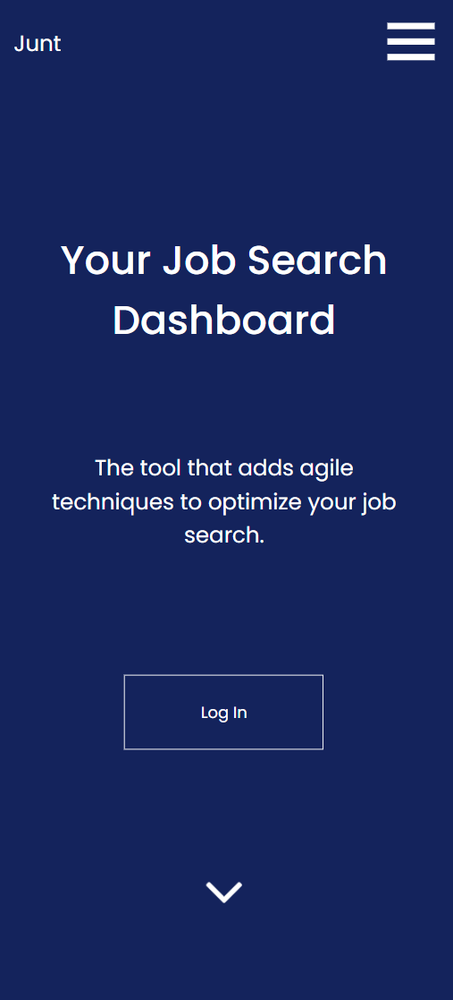
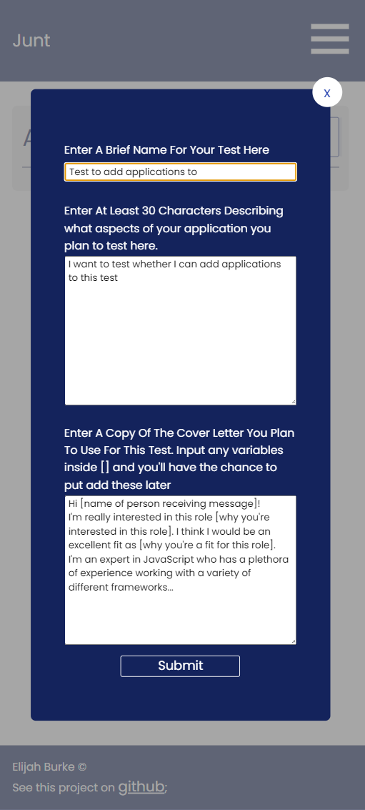
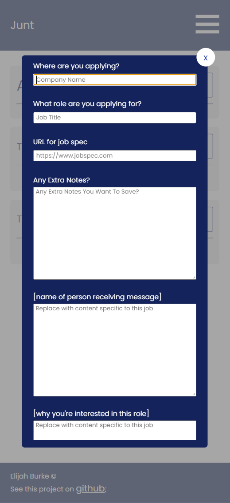
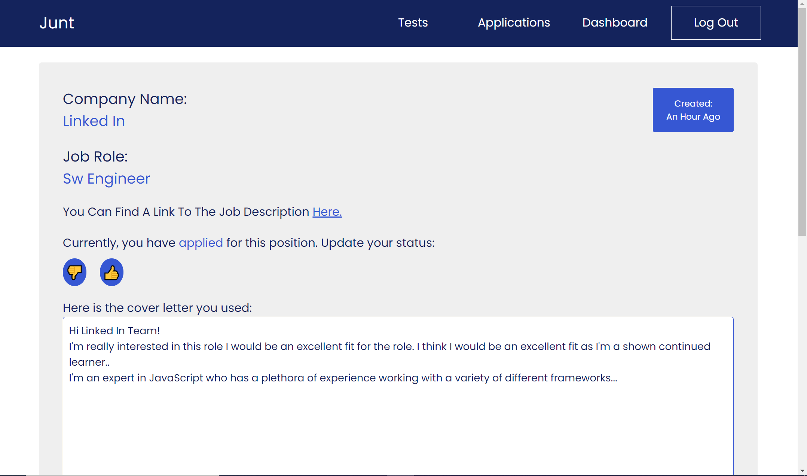
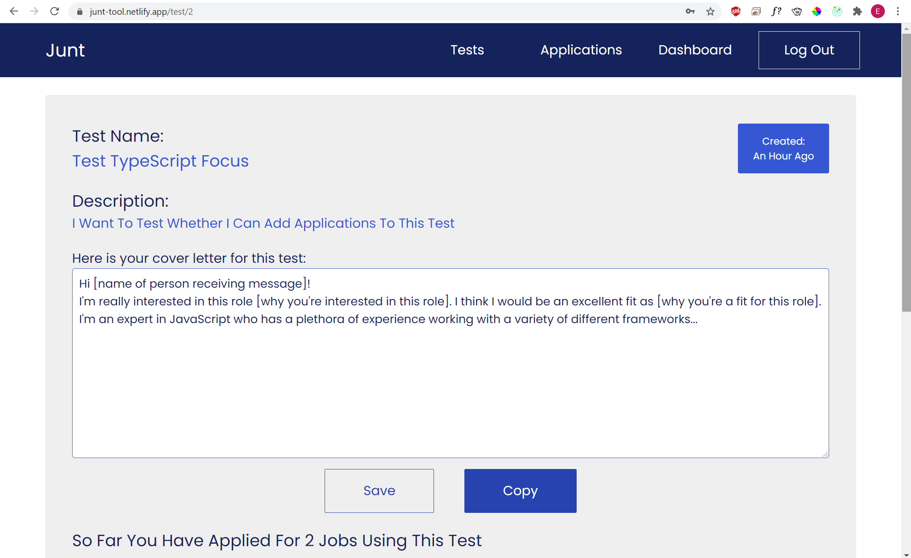

# Junt

Junt is your job search dashboard designed to help you find the best approach to your job search.

Using agile methods such as validated learning and A/B testing we help you find your most succesful approach to finding a job.

## Check Me Out

This app is hosted live on netlify, with the backend being hosted on heroku.

[Find me live here.](https://junt-tool.netlify.app)

## Screenshots

  
  
  
  
  
  
  
  

## Tech Stack

['React', 'Ramda', 'Redux', 'NodeJS', 'PostgreSQL', 'Sequelize']

* [React](https://reactjs.org/)
* [PostgreSQL](https://www.postgresql.org/)
* [Sequelize](https://sequelize.org/)
* [Express](https://expressjs.com/)
* [Ramda](https://ramdajs.com/docs/)
* [Redux](https://redux.js.org/)

## Contributors

* Elijah Burke - [GitHub](https://github.com/ElijahBurke) - [LinkedIn](https://www.linkedin.com/in/elijahburke/)

